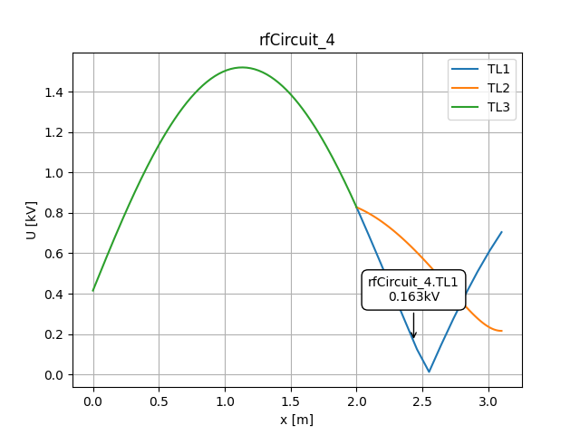

Touchstone files
================
To incorporate touchstone files in a circuit we can make use of the rfObject class.
We'll showcase the use using the TOMAS ICRH matching circuit, of which a diagram is shown below

.. code-block:: python

        from pyRFtk import rfCircuit, rfTRL, rfRLC, rfObject, rfCoupler
        from pyRFtk import plotVSWs

        TRLPart1 = rfTRL(L=0.549, OD=0.041, ID=0.017, dx=500)
        TRLPart2 = rfTRL(L=1.54, OD=0.041, ID=0.017, dx=500)
        TRLPart3 = rfTRL(L=1.856, OD=0.041, ID=0.017, dx=500)
        TRLPart4 = rfTRL(L=1.54, OD=0.041, ID=0.017, dx=500)
        TRLPart5 = rfTRL(L=0.514, OD=0.041, ID=0.017, dx=500)
        #load S matrix of antenna
        Antenna = rfObject(touchstone='tomas_icrh_linear_2017-vacuum.s2p')
        RLCLeft = rfRLC(Cs=CsVal,Cp=CpVal)
        CaRight = rfRLC(Cs=CaVal)

        ct = rfCircuit(Id="MatchingCircuit")

        ct.addblock('TL1',TRLPart1,ports=['A','B'],relpos=0)
        ct.addblock('TL2',TRLPart2,ports=['B','C'],relpos=TRLPart1.L)
        ct.addblock('TL3',TRLPart3,ports=['C','D'],relpos=TRLPart1.L + TRLPart2.L)
        ct.addblock('TL4',TRLPart4,ports=['D','E'],relpos=TRLPart1.L + TRLPart2.L + TRLPart3.L)
        ct.addblock('TL5',TRLPart5,ports=['E','F'],relpos=TRLPart1.L + TRLPart2.L + TRLPart3.L + TRLPart4.L)

        EndOfLine =TRLPart1.L + TRLPart2.L + TRLPart3.L + TRLPart4.L + TRLPart5.L

        ct.addblock('Matching',RLCLeft,ports=['F','G'])
        ct.addblock('RLoss',rfRLC(Rs=1),ports=['in','out'])
        ct.addblock('Antenna',Antenna,ports=['G','H'])
        ct.addblock('PreMatch',CaRight,ports=['H','I'])

        ct.connect('TL1.A','Source')
        ct.connect('TL1.B','TL2.B')
        ct.connect('TL2.C','TL3.C')
        ct.connect('TL3.D','TL4.D')
        ct.connect('TL4.E','TL5.E')
        ct.connect('TL5.F','Matching.F')
        ct.connect('Matching.G','RLoss.in')
        ct.connect('RLoss.out','Antenna.G')
        ct.connect('Antenna.H','PreMatch.H')
        ct.terminate('PreMatch.I',Z=0) #Grounding

